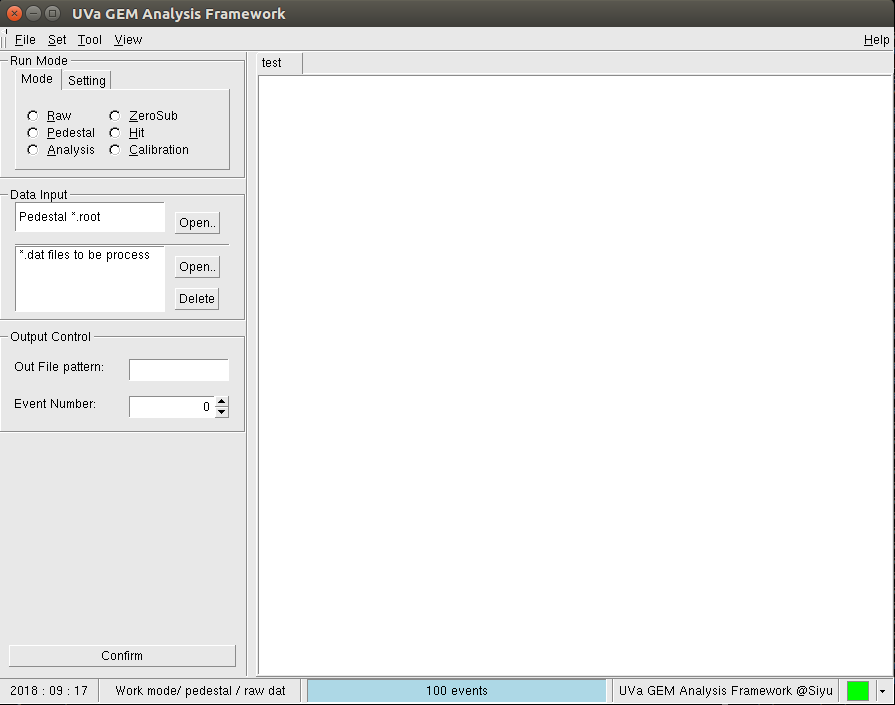
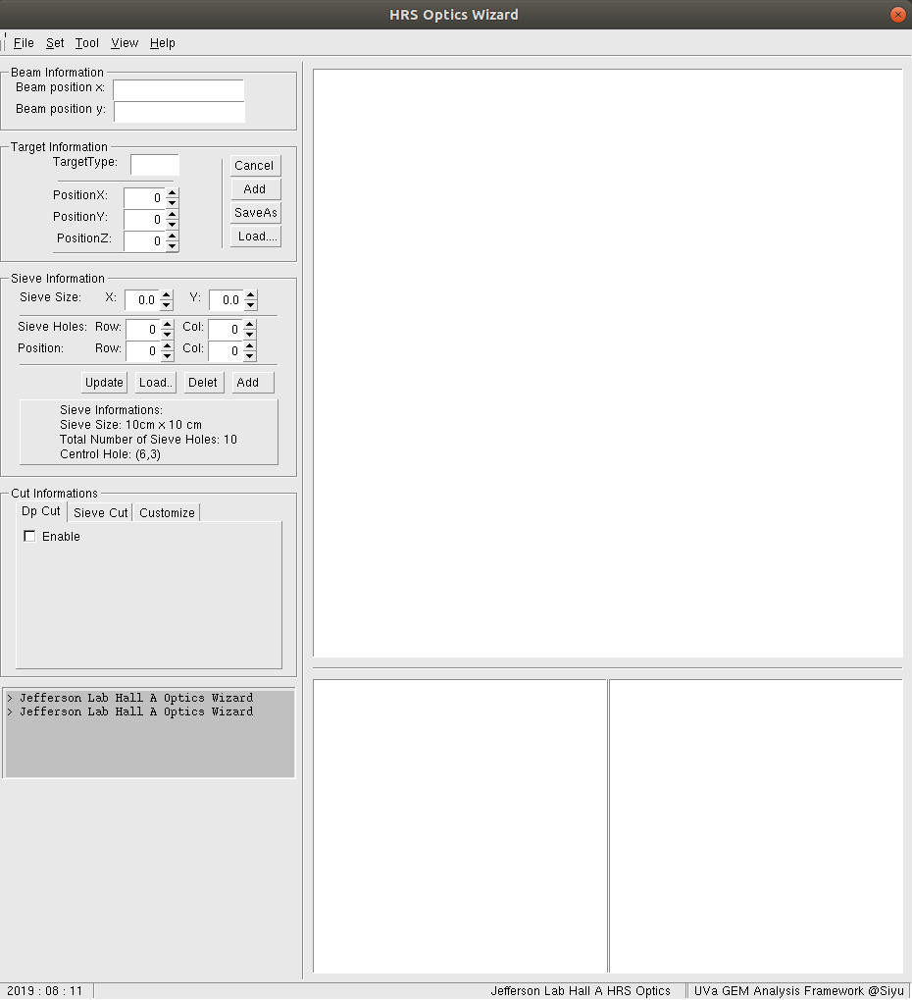

# PRex Viewer GUI
 
The initial version was based on the ROOT-GUI. Used for PRex Viewer GUI and the PRex Optics GUI

## Getting Start

## Prerequisites
*   [HallA Analyzer]()
*	[evio](https://coda.jlab.org/drupal/content/event-io-evio)
*	[root6 or higher](https://root.cern.ch/downloading-root)
*	[libconfig++](http://www.hyperrealm.com/oss_libconfig.shtml)
	
## dev plan

[dev_plan](dev_plan/dev_plan.md)

## examples

# Any Contribution is Welcome!

contect me at: jiansiyu@gmail.com
