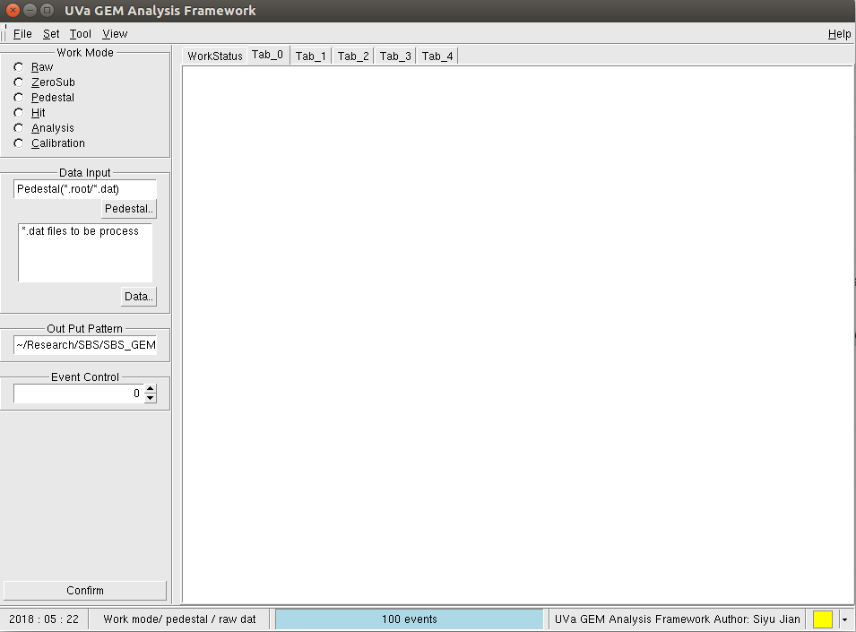

# GEM Decoder GUI

 The GUI version of GEM_Decoder. The code is based on Danning's GEMDecoder which is used for Display, zero subtraction and Analysis GEM data.
 
 The current version support MPD version 3.0 which is the version that used in University of Virginia. MPD VME version 4.0 support is under develepment and will be added soon. 
 

## Getting Start

## Prerequisites

evio
root5.34.36

## Installing

## develep plan

* 1
	* add the MPD4.0 and MPD_SSP data structure support
* 2
	* change the code structure
* 3
	* add the multi-thread support in the GUI
* 4
	* new QT support
* 5
	* new signal transport function
