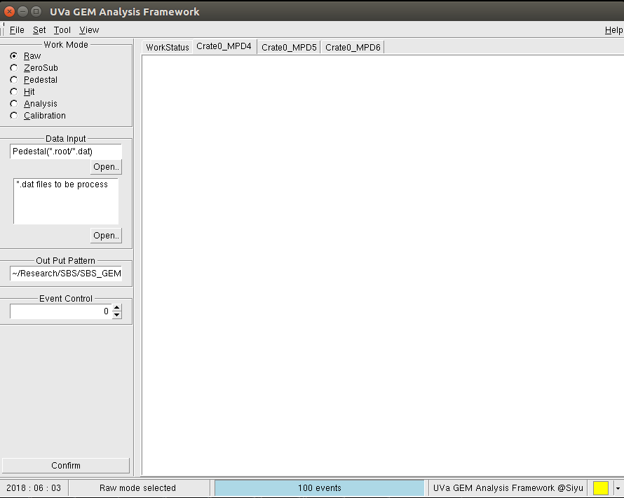

# GEM Decoder GUI

 The GUI version of GEM_Decoder. The code is based on Danning's GEMDecoder which is used for Display, zero subtraction and Analysis GEM data.
 
 MPD4.0-MultiCrate Version. 
 

## Getting Start

## Prerequisites

*	[evio](https://coda.jlab.org/drupal/content/event-io-evio)
*	[root6 or higher](https://root.cern.ch/downloading-root)
*	[libconfig++](http://www.hyperrealm.com/oss_libconfig.shtml)


## Installation

### Compile Locally 
Currently the cmakeList.txt does not work. It is just used for clion IDE. Will add the cmake compatiable soon. 

After install the pre-request, simply install the ROOT_GUI by :
```
make 
```


### ROOT-GUI Pre-Compiled docker image [read more](https://github.com/Jiansiyu/GeneralScripts/tree/master/root_gui_docker)


#### pre-start

* [set up docker container](https://docs.docker.com/engine/install/)

* enable GUI transmission 
```
sudo apt-get install x11-xserver-utils
```
* Get the docker image
```
docker pull uvasiyu/root_gui
```
#### Start the ROOT_GUI Image

##### Option 1, start the docker manually 
* Enable host transmission. Each time robot your PC you may need to run this command

```
xhost +
```

* run docker 
[host data file path] needs to be replaced by the full path of the folder that contains the .dat file. All your result also need to save to this path if you want to save your ROOT_GUI generated result.

Docker will not save any change you made if you do not commit it. So this path is used for exchange the files between host and docker containers.
 
``` 
sudo docker run  -v [host data file path]:/home/rootGUI/data   -v /etc/localtime:/etc/localtime:ro -v /tmp/.X11-unix:/tmp/.X11-unix -e DISPLAY=unix$DISPLAY -e GDK_SCALE -e GDK_DPI_SCALE -it uvasiyu/root_gui
```

##### Option 2(recommend)

get the docker run script:
```
./runDocker.sh
```

#### run the ROOT GUI in Docker

```
cd /home/rootGUI/library
source setup.sh

cd /home/rootGUI/ROOT_GUI_multiCrate
./GEMAnalyzer
```


#### [Reference]
* [How to share data between a docker container and host](https://thenewstack.io/docker-basics-how-to-share-data-between-a-docker-container-and-host/)

* [ROOT-GUI run script](https://github.com/Jiansiyu/GeneralScripts/tree/master/root_gui_docker)

* [ROOT Docker Image](https://hub.docker.com/repository/docker/uvasiyu/root_gui)


